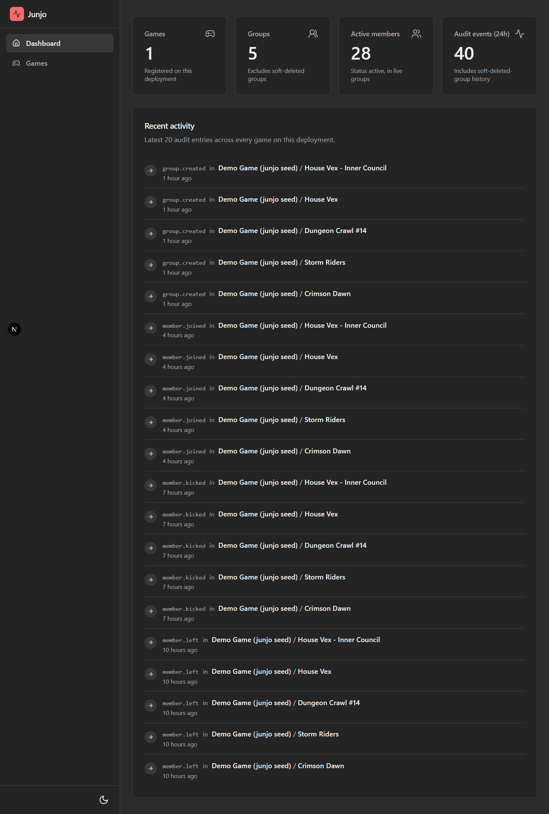
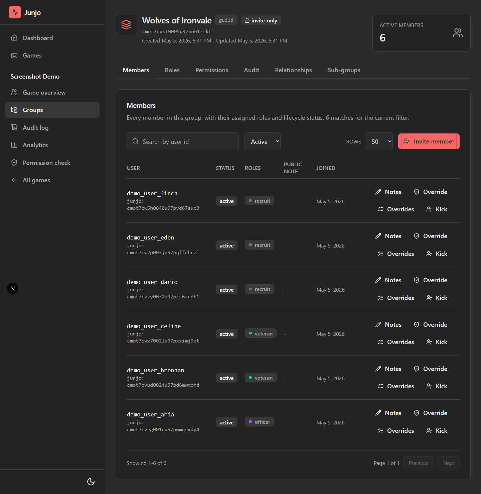
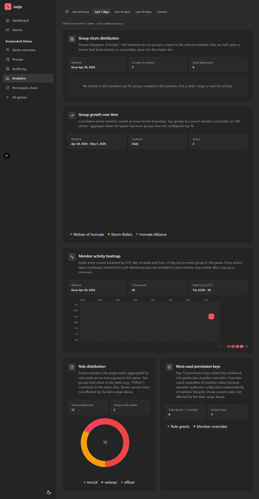

# Junjo

[](https://github.com/GabeCurran/junjo/actions/workflows/ci.yml)
[](./LICENSE)
[](https://www.npmjs.com/package/@junjo.io/sdk)
[](https://www.npmjs.com/package/@junjo.io/react)

**[junjo.io](https://junjo.io)** | **[Docs](https://docs.junjo.io)** | **[npm](https://www.npmjs.com/package/@junjo.io/sdk)**

A backend and TypeScript SDK for your game's social layer: guilds, clans,
parties, ranks, permissions, friends, and invitations. It takes a user id
from the auth you already run and manages the group data under it. Self-host
the server or use the hosted beta.

```sh
npm install @junjo.io/sdk
```

```ts
import { Junjo } from "@junjo.io/sdk";

const junjo = new Junjo({ apiKey: process.env.JUNJO_API_KEY });

const guild = await junjo.groups.create({ kind: "guild", name: "Crimson Dawn" });
await junjo.groups.inviteByUserId(guild.id, "user_123");

const allowed = await junjo.can("user_123", guild.id, "invite_member");
```



## What's in the box

- **`@junjo.io/sdk`**: typed TypeScript client for any Node or browser app.
- **`@junjo.io/react`**: React hooks (`useGroup`, `useMembers`, `useCan`, ...) with optimistic updates.
- **Junjo.io SDK for Roblox** (`packages/sdk-roblox`, will ship as `Junjo.rbxm` on GitHub releases): Luau client for Roblox experiences.
- **Junjo.io SDK for C++** (`packages/sdk-cpp`): C++20 client library for game servers, installed as a CMake `find_package(JunjoIO)` package.
- **Junjo.io SDK for Unreal Engine** (`packages/sdk-unreal`): source plugin over the C++ core with a game instance subsystem, Blueprint async nodes, and live SSE event streams.
- **Cross-game admin dashboard**: Next.js app for inspecting and managing groups across games.
- **Server**: Hono on Node, Postgres via Prisma. Self-hostable (source-available, ELv2) or use the cloud.
- **Auth adapters**: Clerk, Supabase, JWT, BYO.

## A few screens from the admin dashboard

| Group members | Per-game analytics |
| --- | --- |
|  |  |

## Documentation

Docs live at **[docs.junjo.io](https://docs.junjo.io)**: getting started, the
SDK and React references, auth adapter guides (Clerk, Supabase, JWT, custom),
the HTTP API reference, and the self-hosting guide. The source is `apps/docs`
(Nextra); locally it runs at `http://localhost:3001` under `npm run dev`.

## Hosted beta

Managed Junjo with the admin dashboard and Postgres included. Free while in
beta. Email [gabecurran01@gmail.com](mailto:gabecurran01@gmail.com?subject=Junjo%20hosted%20beta)
and I will set you up.

## Local development

```sh
git clone https://github.com/GabeCurran/junjo
cd junjo
npm install

# Boots Postgres (Docker), runs migrations, seeds a demo dataset, and
# starts the server, dashboard, and docs site in parallel.
npm run dev
```

Pre-flight: Docker Desktop must be running. On first run, the dev script:

- Creates a Postgres container (`junjo-test-pg` on port 5433). Override the port with `JUNJO_DB_PORT=5499 npm run dev` if 5433 is already taken on your host. The `DATABASE_URL` and `TEST_DATABASE_URL` lines in `.env` are reconciled against the current `JUNJO_DB_PORT` on every dev run, so manual edits to those two lines will be overwritten.
- Auto-generates `.env` (root) and `apps/dashboard/.env.local` with sane dev defaults if either is missing, including a freshly minted admin token and the demo game's API key.
- Seeds a representative demo dataset that exercises every dashboard surface.

Once the dev servers are up:

- **Dashboard**: http://localhost:3000 (basic-auth user `admin`, password `admin`)
- **Docs site**: http://localhost:3001
- **API**: http://localhost:8787

Integrating against the API from another local project (port 3000 already in use, dashboard not needed)? Use `npm run dev:server-only` to skip the dashboard and docs and boot just Postgres + the API server.

The seed prints the game ID and API key to the terminal; the same values are written into the env files automatically.

## Repository layout

```
packages/
  server/       Hono HTTP API + Prisma schema + webhook worker
  sdk/          @junjo.io/sdk, typed TypeScript client
  react/        @junjo.io/react, React hooks
  sdk-roblox/   Junjo.io SDK for Roblox, Luau client (will ship as Junjo.rbxm)
  sdk-cpp/      Junjo.io SDK for C++, C++20 client (CMake package JunjoIO)
  sdk-unreal/   Junjo.io SDK for Unreal Engine, source plugin over the C++ core
  shared/       @junjo.io/shared, shared types
apps/
  dashboard/    Next.js admin dashboard (proprietary)
  docs/         Nextra documentation site
examples/
  webgame-threejs/   Plain-browser guild panel on the SDK in proxy mode (no framework or build step; name is historical, no Three.js)
  roblox-mobarena/   Pointer to the Roblox SDK dogfood target (separate repo)
  cpp-consumer/      Standalone CMake consumer of the installed C++ SDK
tools/
  screenshots/  Puppeteer screenshot crawler for visual QA
  diagrams/     Mermaid renderer
scripts/        Repo-level dev and CI scripts (style gate, commit-msg check, dev Postgres bootstrap)
docs/           Repo assets (README screenshots)
```

## License

MIT for the client packages (`packages/sdk`, `packages/react`, `packages/shared`, `packages/sdk-roblox`, `packages/sdk-cpp`, `packages/sdk-unreal`). The server (`packages/server`) is source-available under the Elastic License 2.0: read it, run it, self-host it for your own games, but do not offer it to third parties as a hosted service. The dashboard at `apps/dashboard` is proprietary (see `apps/dashboard/LICENSE`).
