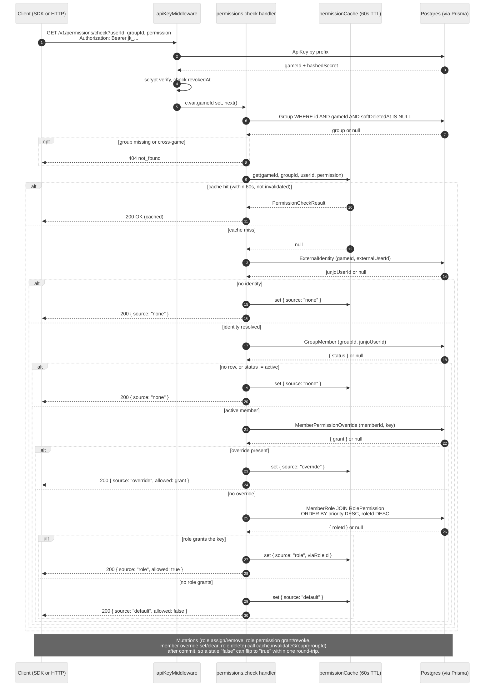

# Permissions

The permissions surface answers a single question: "is this user allowed to do this thing in this group?" Junjo has no opinion about what the permission keys mean: the dev defines them per game (`guild.kick`, `claim_territory`, `edit_treasury`) and Junjo stores them verbatim.

A permission outcome is a function of:

1. The member's `MemberPermissionOverride` rows. A member-level override (in either direction) wins over any role-derived grant.
2. The member's roles via `MemberRole`. If any role has a `RolePermission` for the key, the permission is granted.

The route exposes this resolution via `GET /v1/permissions/check`. The result is cached in-process for 60 seconds; mutations that can change a permission outcome (role assignments, role permission grants/revokes, member-level overrides, role deletes) invalidate the cache for the affected group on commit.

## Resolution flow



The diagram above is committed at `tools/diagrams/source/permission-resolution.mmd`. The committed `.mmd` source and the Mermaid fence above must stay byte-identical.

## Wire format

`PermissionCheckResult`:

| Field | Type | Notes |
|-------|------|-------|
| `allowed` | boolean | True if the user has the permission, false otherwise. |
| `source` | `"role" \| "override" \| "default" \| "none"` | See [Source taxonomy](#source-taxonomy) below. |
| `viaRoleId` | string | Present only when `source === "role"`; the highest-priority role that granted it. |

### Source taxonomy

| Source | When | Allowed |
|--------|------|---------|
| `none` | The user has no `ExternalIdentity` for this game, has no `GroupMember` row in this group, or is a non-active member (`left`, `kicked`, `invited`). | `false` |
| `default` | The user is an active member with no override and no role granting this permission. | `false` |
| `role` | At least one of the member's roles has the permission via `RolePermission`. The route returns the highest-priority granting role in `viaRoleId` (priority desc, then id desc as a tiebreaker). | `true` |
| `override` | A `MemberPermissionOverride` exists for this member and key. `allowed` mirrors `override.grant`. | `override.grant` |

Resolution order is: override (if present) → role (any matching) → default. A non-active member short-circuits the resolver to `none` regardless of stored roles or overrides; the lifecycle gate is enforced here, not by mutating role / override rows on transition.

## `GET /v1/permissions/check`

Returns the canonical `PermissionCheckResult`. Read-through cache.

### Query parameters

| Field | Required | Notes |
|-------|----------|-------|
| `userId` | yes | The dev's external user id. |
| `groupId` | yes | The group to check against. Must belong to the calling game and not be soft-deleted. |
| `permission` | yes | The permission key. 1-128 characters. |

### Response

`200 OK` with a `PermissionCheckResult` body:

```json
{
  "allowed": true,
  "source": "role",
  "viaRoleId": "role_officer"
}
```

```json
{
  "allowed": false,
  "source": "default"
}
```

### Errors

| code | status | when |
|------|--------|------|
| `bad_request` | 400 | Missing or empty query params, or `permission` is over 128 characters. |
| `not_found` | 404 | Group does not exist in the calling game (cross-game and soft-deleted both collapse here). |
| `invalid_api_key` | 401 | API key missing, malformed, or revoked. |

### Caching

The route caches each `(gameId, groupId, userId, permission)` answer for 60 seconds (the `PERMISSION_CACHE_TTL_MS` constant in `packages/server/src/permissionCache.ts`). The cache is per-process, in-memory, and unbounded in size; it is not a Redis dependency.

The following mutations invalidate the cache for the affected group on commit:

- `POST /v1/groups/:id/members/:userId/roles/:roleId` - role assignment
- `DELETE /v1/groups/:id/members/:userId/roles/:roleId` - role removal
- `POST /v1/groups/:id/members/:userId/permissions/:permission` - override set/update
- `DELETE /v1/groups/:id/members/:userId/permissions/:permission` - override clear
- `POST /v1/roles/:id/permissions` - role permission grant
- `DELETE /v1/roles/:id/permissions/:permission` - role permission revoke
- `DELETE /v1/roles/:id` - role delete (cascades to MemberRole / RolePermission rows)

A stale cached answer can persist for up to the TTL window if a row is mutated outside the API (e.g. directly via SQL), so prefer the API for any change you need to surface immediately.

### Idempotency

The route has no side effects beyond writing the cache entry. Two consecutive calls with the same params return the same answer. The cache hit / miss is not exposed in the response.
