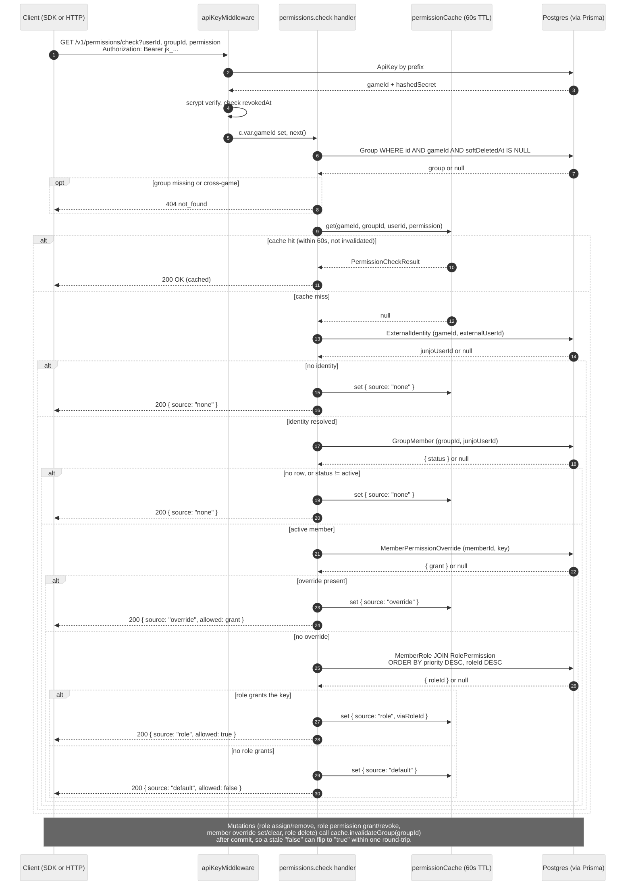

# Permissions

The permissions surface answers a single question: "is this user allowed to do this thing in this group?" Junjo has no opinion about what the permission keys mean: the dev defines them per game (`guild.kick`, `claim_territory`, `edit_treasury`) and Junjo stores them verbatim.

A permission outcome is a function of:

1. The member's `MemberPermissionOverride` rows. A member-level override (in either direction) wins over any role-derived grant.
2. The member's roles via `MemberRole`. If any role has a `RolePermission` for the key, the permission is granted.

The route exposes this resolution via `GET /v1/permissions/check`. The result is cached in-process for 60 seconds; mutations that can change a permission outcome (role assignments, role permission grants/revokes, member-level overrides, role deletes) invalidate the cache for the affected group on commit.

## Resolution flow



The diagram above is committed at `tools/diagrams/source/permission-resolution.mmd`. The committed `.mmd` source and the Mermaid fence above must stay byte-identical.

## Wire format

`PermissionCheckResult`:

| Field | Type | Notes |
|-------|------|-------|
| `allowed` | boolean | True if the user has the permission, false otherwise. |
| `source` | `"role" \| "override" \| "default" \| "none"` | See [Source taxonomy](#source-taxonomy) below. |
| `viaRoleId` | string | Present only when `source === "role"`; the highest-priority role that granted it. |
| `viaGroupId` | string | Present only on an [inherited check](#inheritance) that reached a decision. It names the group the decision was read from, and equals the queried group when the decision was direct. Absent entirely when `inherit` was not requested, so the non-inherited wire shape is unchanged. |

### Source taxonomy

| Source | When | Allowed |
|--------|------|---------|
| `none` | The user has no `ExternalIdentity` for this game, has no `GroupMember` row in this group, or is a non-active member (`left`, `kicked`, `invited`). | `false` |
| `default` | The user is an active member with no override and no role granting this permission. | `false` |
| `role` | At least one of the member's roles has the permission via `RolePermission`. The route returns the highest-priority granting role in `viaRoleId` (priority desc, then id desc as a tiebreaker). | `true` |
| `override` | A `MemberPermissionOverride` exists for this member and key. `allowed` mirrors `override.grant`. | `override.grant` |

Resolution order is: override (if present) → role (any matching) → default. A non-active member short-circuits the resolver to `none` regardless of stored roles or overrides; the lifecycle gate is enforced here, not by mutating role / override rows on transition.

## `GET /v1/permissions/check`

Returns the canonical `PermissionCheckResult`. Read-through cache.

### Query parameters

| Field | Required | Notes |
|-------|----------|-------|
| `userId` | yes | The dev's external user id. |
| `groupId` | yes | The group to check against. Must belong to the calling game and not be soft-deleted. |
| `permission` | yes | The permission key. 1-128 characters. |
| `inherit` | no | `"true"` or `"false"` (any other value is a `400`). `"true"` walks the group's ancestors; see [Inheritance](#inheritance). Defaults to false. |

### Response

`200 OK` with a `PermissionCheckResult` body:

```json
{
  "allowed": true,
  "source": "role",
  "viaRoleId": "role_officer"
}
```

```json
{
  "allowed": false,
  "source": "default"
}
```

### Errors

| code | status | when |
|------|--------|------|
| `bad_request` | 400 | Missing or empty query params, or `permission` is over 128 characters. |
| `not_found` | 404 | Group does not exist in the calling game (cross-game and soft-deleted both collapse here). |
| `invalid_api_key` | 401 | API key missing, malformed, or revoked. |

### Inheritance

Groups form a parent/child hierarchy (`setParent` / `listChildren`). By default a check ignores it entirely: resolution runs against direct membership in the queried group and nothing else. Pass `inherit=true` to opt into a server-side walk.

The walk visits the queried group first, then its ancestors, nearest first, and **stops at the first group that decides**:

- an `override` at that level, in either direction, decides;
- a `role` granting the key at that level decides;
- `none` (not an active member there) and `default` (member, no grant) are inconclusive, and the walk continues to the parent.

Nearest wins, so a child's explicit deny is **not** undone by a grant further up. If nothing on the chain decides, the queried group's own result is returned unchanged, which preserves the `none` versus `default` distinction that tells "not a member" apart from "member without the grant".

Two boundaries the walk will not cross: a **soft-deleted** ancestor terminates the chain, and an ancestor belonging to a **different game** terminates it too. Depth is bounded by `MAX_PARENT_DEPTH` (100); writes are cycle-checked, so that bound only matters against corrupted state.

The whole chain resolves in one recursive CTE plus one resolution per level, server-side. That replaces the two HTTP round-trips per level (a `check` and a `groups.get`) that a client-side walker costs.

```json
{
  "allowed": true,
  "source": "role",
  "viaRoleId": "role_admin",
  "viaGroupId": "grp_instance"
}
```

Inherited answers are cached under a separate key from direct ones, and are filed against **every** group on the walked chain, so a grant change at any ancestor drops them.

## `POST /v1/permissions/check-batch`

Resolves many checks in one round-trip. Answers are positional: `results[i]` corresponds to `checks[i]`.

### Body

| Field | Required | Notes |
|-------|----------|-------|
| `checks` | yes | Array of 1 to 100 `{ userId, groupId, permission }` objects. Unknown fields on an entry are a `400`. |
| `inherit` | no | Boolean. Applies to every entry; there is no per-entry flag. |

```json
{
  "checks": [
    { "userId": "user_alice", "groupId": "grp_shop_a", "permission": "shop.view" },
    { "userId": "user_alice", "groupId": "grp_shop_b", "permission": "shop.view" }
  ]
}
```

### Response

`200 OK` with `{ "results": [...] }`, each element the same `PermissionCheckResult` the single-check route returns:

```json
{
  "results": [
    { "allowed": true, "source": "role", "viaRoleId": "role_shopper" },
    { "allowed": false, "source": "none" }
  ]
}
```

### Errors

| code | status | when |
|------|--------|------|
| `bad_request` | 400 | `checks` missing, empty, over 100 entries, or an entry is malformed. |
| `not_found` | 404 | Any `groupId` is unknown, soft-deleted, or belongs to another game. The message names the offending entry's index (`group for checks[3] not found`). |
| `invalid_api_key` | 401 | API key missing, malformed, or revoked. |

An unknown group fails the **whole** request rather than resolving that entry as denied, so a typo surfaces instead of silently reading as a denial.

### Cost

A batch is one rate-limited request regardless of how many entries it carries, which is the point: the 100-entry cap is what bounds the server-side work one request can buy. Entries are resolved sequentially, sharing the same identity lookups and the same cache the single-check route uses, so a repeated triple inside a batch costs a map lookup rather than another resolution.

### Caching

The route caches each `(gameId, groupId, userId, permission)` answer for 60 seconds (the `PERMISSION_CACHE_TTL_MS` constant in `packages/server/src/permissionCache.ts`). The cache is per-process, in-memory, and unbounded in size; it is not a Redis dependency. `check-batch` shares the same cache, and inherited answers occupy a separate keyspace from direct ones.

The following mutations invalidate the cache for the affected group on commit:

- `POST /v1/groups/:id/members/:userId/roles/:roleId` - role assignment
- `DELETE /v1/groups/:id/members/:userId/roles/:roleId` - role removal
- `POST /v1/groups/:id/members/:userId/permissions/:permission` - override set/update
- `DELETE /v1/groups/:id/members/:userId/permissions/:permission` - override clear
- `POST /v1/roles/:id/permissions` - role permission grant
- `DELETE /v1/roles/:id/permissions/:permission` - role permission revoke
- `DELETE /v1/roles/:id` - role delete (cascades to MemberRole / RolePermission rows)

A stale cached answer can persist for up to the TTL window if a row is mutated outside the API (e.g. directly via SQL), so prefer the API for any change you need to surface immediately.

### Idempotency

The route has no side effects beyond writing the cache entry. Two consecutive calls with the same params return the same answer. The cache hit / miss is not exposed in the response.
