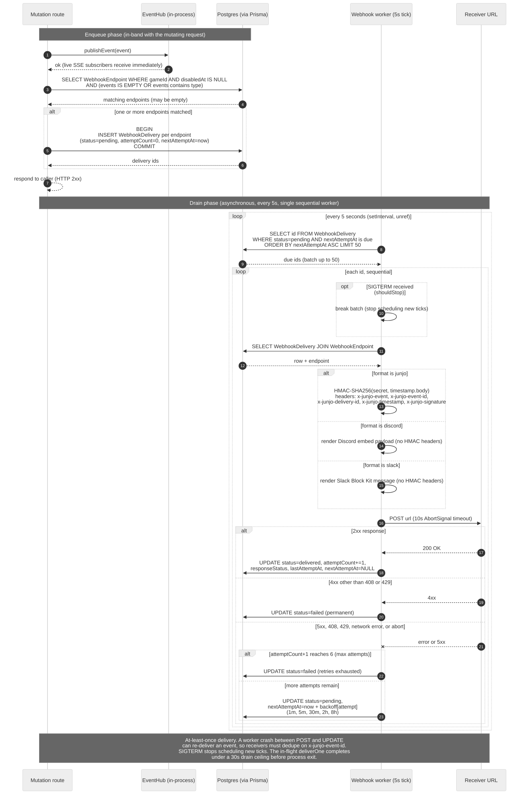

# Webhooks

Webhooks are Junjo's durable counterpart to the [SSE event stream](./events.mdx). Every `JunjoEvent` published by a mutation route is also enqueued as a `WebhookDelivery` row for every active `WebhookEndpoint` that matches the event type. A background worker drains the queue, signs each request with HMAC-SHA256, and POSTs the event to the dev's URL with retry and exponential backoff.

This page documents the wire format, retry semantics, signature scheme, and the `/v1/webhooks` CRUD routes that configure endpoints. The receiver-side helpers live in [`junjo.webhooks`](../sdk/webhooks).

## Delivery lifecycle

1. A mutation route commits its database transaction.
2. The route calls `dispatchEvent(...)`, which broadcasts to the SSE hub AND inserts one `WebhookDelivery` row per matching `WebhookEndpoint` (state `pending`, `nextAttemptAt = now()`).
3. The webhook worker (a background `setInterval` inside the same Node process as the API) polls due deliveries every 5 seconds.
4. For each due delivery, the worker:
   - Loads the row and the matching endpoint.
   - Serializes the stored payload to JSON.
   - Signs the body with the endpoint's secret using HMAC-SHA256.
   - POSTs the body to the endpoint URL with the signature and timestamp headers.
   - Updates the delivery row based on the HTTP response.
5. On success, the row transitions to `delivered`. On retriable failure, the row stays `pending` with `nextAttemptAt` advanced. On terminal failure, the row transitions to `failed`.

## End-to-end flow



The diagram source lives at `tools/diagrams/source/webhook-delivery.mmd` and is kept byte-identical to this embedded fence.

## Wire format

Each delivery is one HTTP POST. Headers:

| Header | Notes |
|--------|-------|
| `content-type` | Always `application/json`. |
| `x-junjo-event` | The event's `type` field (`group.updated`, `member.joined`, ...). |
| `x-junjo-event-id` | The event's `id` (24-char hex). Stable across retries; safe to use for receiver-side dedupe. |
| `x-junjo-delivery-id` | The `WebhookDelivery.id`. Unique per delivery attempt; identifies this particular POST in support tickets. |
| `x-junjo-timestamp` | ISO 8601 timestamp the request was signed at. Bound into the HMAC; receivers verify this is within their tolerance window (5 minutes by default in `webhooks.verify`). |
| `x-junjo-signature` | HMAC-SHA256 of `<x-junjo-timestamp>.<body>`, hex-encoded, prefixed with the scheme version (`v1=`). |

The body is the JSON-serialized `JunjoEvent`. Date fields render as ISO 8601 strings; branded ids render as plain strings. The body bytes are exactly what the signature is computed over - receivers MUST verify the signature against the raw body before parsing JSON.

Example POST:

```
POST https://dev.example.com/webhooks/junjo
content-type: application/json
x-junjo-event: group.updated
x-junjo-event-id: 7b3e0d8c4a9f1d2e5b6c8a0f
x-junjo-delivery-id: del_xyz
x-junjo-timestamp: 2026-04-28T12:30:00.000Z
x-junjo-signature: v1=4f9b3e8c1a7d2f0b9e8a6c5d4f3a2b1c9e8f7d6c5b4a3210f9e8d7c6b5a4938

{
  "id": "7b3e0d8c4a9f1d2e5b6c8a0f",
  "type": "group.updated",
  "gameId": "game_xyz",
  "groupId": "grp_qrs",
  "occurredAt": "2026-04-28T12:30:00.000Z",
  "group": {
    "id": "grp_qrs",
    "name": "Crimson Wolves",
    ...
  }
}
```

## Signature scheme

The signature is `v1=<hex-hmac-sha256(secret, "<timestamp>.<body>")>`. The `v1=` prefix lets future schemes coexist; the V1 verifier rejects everything else.

Receivers compute the same HMAC and compare in constant time. The SDK helper [`junjo.webhooks.verify`](../sdk/webhooks#verifyrawbody-headers-secret-opts---shipped) performs that check (and the [`junjo.webhooks.middleware`](../sdk/webhooks#middlewaresecret-opts---shipped) Express adapter wraps it); receivers in other languages can reproduce it with any HMAC-SHA256 library. Pseudocode:

```
expected = "v1=" + hex(hmac_sha256(secret, timestamp + "." + body))
constant_time_compare(expected, signature_header)
```

Verifying the timestamp prevents replay attacks: reject anything older than ~5 minutes.

## Retry policy

Deliveries are retried with exponential backoff up to **6 total attempts**. Backoff between attempts:

| After attempt | Wait before next attempt |
|---------------|--------------------------|
| 1 | 1 minute |
| 2 | 5 minutes |
| 3 | 30 minutes |
| 4 | 2 hours |
| 5 | 8 hours |

The 6th attempt is terminal: success or failure, no further retries.

A response is retried when:
- The HTTP response is `5xx` (server error).
- The HTTP response is `408 Request Timeout` or `429 Too Many Requests`.
- The request fails before a response arrives (network error, DNS failure, connection abort, request timeout > 10 seconds).

A response is **not** retried (and the delivery is marked `failed` immediately) when:
- The HTTP response is any other `4xx`. The receiver explicitly told us this request is malformed; retrying with the same body wastes both sides' time. Fix the receiver; manual replay is a post-V1 idea.

A 2xx response marks the delivery `delivered` and stops retrying.

## Endpoint configuration

Endpoints are configured per game through the `/v1/webhooks` routes below. The dev-facing SDK ergonomics live at [`junjo.webhooks.endpoints`](../sdk/webhooks#endpoints---shipped).

Each endpoint carries:

- `url` - destination for the POST. Must use `https://` or `http://`.
- `events` - array of event types this endpoint subscribes to. **Empty array means match-all** (the friendly default for "I want everything"). Non-empty array filters to the listed types; unknown event types are rejected at create / update time.
- `format` - wire format applied at delivery time. Defaults to `"junjo"` (raw `JunjoEvent` JSON with HMAC headers). `"discord"` produces a [Discord embed payload](./webhooks-discord.mdx) and `"slack"` produces a [Slack Block Kit message](./webhooks-slack.mdx); both skip the HMAC headers (those targets authenticate via URL token, not signed headers).
- `disabledAt` - when set, the endpoint is muted: matching events do not enqueue deliveries to it.
- `secret` - the HMAC signing key. Stored in recoverable form so the worker can sign requests; surfaced exactly once on `POST /v1/webhooks` and never again. Persist it on creation. The signing path is skipped for non-`junjo` formats, but the column still stores the secret in case the dev rotates the format back later.

### Wire format

`WebhookEndpoint`:

| Field | Type | Notes |
|-------|------|-------|
| `id` | string | Server-generated. |
| `gameId` | string | Always equals the calling game's id. |
| `url` | string | Destination. |
| `events` | `string[]` | Subset of [`JunjoEventType`](./events.mdx). Empty array = match-all. |
| `format` | `"junjo" \| "discord" \| "slack"` | Wire format applied at delivery time. See [Discord format](./webhooks-discord.mdx) and [Slack format](./webhooks-slack.mdx). Defaults to `"junjo"`. |
| `createdAt` | ISO 8601 | |
| `disabledAt` | ISO 8601 \| null | |

`POST /v1/webhooks` returns the same shape with an extra `secret` field. The secret is omitted on every other response.

### `POST /v1/webhooks`

Body: `{ url, events?, secret?, format? }`. If `secret` is omitted the server generates a 32-byte base64url secret. The response is 201 Created and includes `secret` exactly once - persist it server-side immediately. `events` defaults to `[]` (match-all). `format` defaults to `"junjo"`.

| Validation | Notes |
|------------|-------|
| `url` | Required. Must parse as `http://` or `https://`. Max 2000 chars. By default the server also rejects URLs whose hostname is loopback (`localhost`, `127/8`, `::1`), link-local (`169.254/16`, `fe80::/10`, includes the cloud-metadata endpoint), RFC1918 (`10/8`, `172.16/12`, `192.168/16`), RFC6598 CGNAT, IPv6 ULA, or `0.0.0.0` (an SSRF guard). The check is lexical, so DNS rebinding still wins; operator network policy is the V1 backstop. Self-host development can flip the `WEBHOOK_ALLOW_PRIVATE_HOSTS=true` env var on the server to permit them. |
| `events` | Optional. Each entry must be a valid `JunjoEventType`; unknown types return 400. |
| `secret` | Optional. 16-256 chars. |
| `format` | Optional. One of `"junjo"`, `"discord"`, or `"slack"`. Unknown values return 400. |

Errors:

| Status | Code | When |
|--------|------|------|
| 400 | `bad_request` | Missing url, malformed URL, URL pointed at a private / loopback / link-local host, unknown event type, secret too short, malformed JSON. |
| 401 | `invalid_api_key` | Missing or invalid Authorization header. |

### `GET /v1/webhooks`

Returns `{ items: WebhookEndpoint[], nextCursor: null }` for the calling game, sorted by `createdAt desc, id desc`. The secret is not included. The response conforms to the same `Page<T>` envelope as every other list endpoint; today there is no pagination (typical games have a handful of endpoints) so `nextCursor` is always `null`. Adding `?limit&cursor` later is a purely additive change.

### `PATCH /v1/webhooks/:id`

Body: `{ url?, events?, disabled?, format? }`. At least one field is required.

- `url` revalidated as on create, including the SSRF guard described above.
- `events` replaces wholesale; `[]` clears the filter (match-all).
- `disabled: true` stamps `disabledAt = now()`. `disabled: false` clears it. Idempotent on matching values.
- `format` switches the wire format applied to future deliveries. Pending deliveries enqueued before the switch will be re-rendered using the new format when the worker reaches them, so a format flip mid-queue is safe.

Returns the post-state `WebhookEndpoint` (no secret). A no-op PATCH (matching url, events, disabled, format) returns the unchanged row without writing.

Errors:

| Status | Code | When |
|--------|------|------|
| 400 | `bad_request` | Empty body, invalid url, unknown event type, malformed JSON. |
| 404 | `not_found` | Endpoint does not exist or belongs to a different game. |
| 401 | `invalid_api_key` | Missing or invalid Authorization header. |

### `DELETE /v1/webhooks/:id`

Hard-deletes the endpoint and cascades to any pending `WebhookDelivery` rows. Returns 204. A second DELETE on the same id returns 404 (no idempotent-on-missing-row contract: the dev should hold onto the id only as long as it exists).

## Limitations and trade-offs

The V1 worker is single-process, single-instance:

- **No cross-process coordination.** Two server processes running the worker would both pick up the same due deliveries. The `WEBHOOK_BACKOFF_MS` interval and the `WebhookDelivery` row state are the only coordination. When this scales out, the right move is `pg_try_advisory_lock(webhookEndpointId)` keyed per-endpoint so the same endpoint cannot be hit by two workers concurrently. The function signatures in `webhookWorker.ts` are stable across that change.
- **At-least-once delivery.** A worker crash between POST and row update can re-deliver an event. Receivers MUST be idempotent on `x-junjo-event-id`.
- **No replay UI.** Manual replay of `failed` deliveries is not exposed through the API; replays require direct database access.
- **No dead-letter queue.** Permanently failed deliveries stay in the `WebhookDelivery` table; they're not deleted automatically.
- **No body capture for debug.** The worker records the response status but does not capture the response body.
