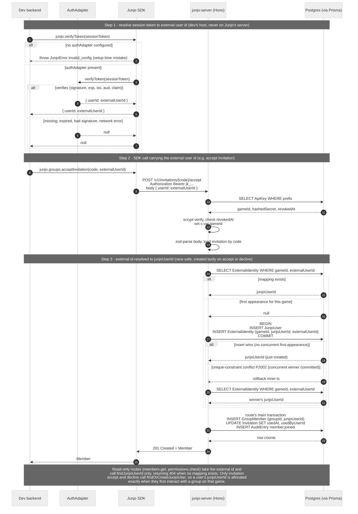

# Auth adapters

An `AuthAdapter` resolves a player's session token to a stable user id. Junjo never issues session tokens of its own; it sits behind your existing auth provider (Clerk, Supabase, a JWT issuer, your own session-token store, Roblox's player API) and trusts whatever user id that provider returns.

The dev's backend supplies the user id at the API-key boundary: most Junjo routes accept the user id as a path or body parameter, and the dev's backend has already resolved it. The auth adapter is for the few server-side flows that need to verify a token before resolving an id, plus the SDK's `verifyToken(token)` helper.

## The interface

```ts
import type { AuthAdapter } from "@junjo.io/sdk";

export interface AuthAdapter {
  verifyToken(token: string): Promise<{ userId: UserId } | null>;
}
```

One method, one return shape. Resolve the token, return the user id; on any failure (missing token, bad signature, expired session, network error against the upstream verifier), return `null`. `JunjoError({ code: "invalid_config" })` is reserved for setup-time misconfiguration that should fail loud at startup, not at runtime.

The user id is opaque to Junjo. Whatever string your auth provider returns (Clerk's `user_2abc...`, a Supabase UUID, a Roblox numeric `UserId` rendered as a string, a Lucia session's `userId` field) is the value Junjo persists in its `ExternalIdentity` table the first time the user appears in a given game.

## When to use which

| Adapter | Use when |
|---------|----------|
| [`jwtAdapter`](/auth/jwt) | Your auth provider issues JWTs and you want Junjo to validate the signature, expiration, and claims locally. Works with most cloud providers (Auth0, Cognito, Keycloak), custom JWT issuers, and server-issued session JWTs. Three algorithms supported: `HS256`, `RS256`, `ES256`. |
| [`clerkAdapter`](/auth/clerk) | Your app uses [Clerk](https://clerk.com/) for authentication. The adapter wraps Clerk's `verifyToken` so you keep Clerk-specific config (secret key, audience, authorized parties) close to your existing Clerk setup. |
| [`supabaseAdapter`](/auth/supabase) | Your app uses [Supabase Auth](https://supabase.com/auth). The adapter calls `client.auth.getUser(token)` against the Supabase client you already construct for the rest of your backend. |
| [`BYO` (build your own)](/auth/byo) | Your auth provider does not fit the three above. Roblox's player API, Lucia / hand-rolled session-token stores, Auth0 with custom session shapes, internal SSO systems, opaque session strings backed by a database. |

The three built-in adapters are not mutually exclusive with BYO; they are convenience wrappers. Anything they handle can be reproduced with a 10-line BYO adapter. The reason to prefer the built-ins when they fit: they pin down the failure modes (token format, claim mapping, network errors) so you do not have to.

## Where it plugs in

```ts
import { Junjo } from "@junjo.io/sdk";
import { jwtAdapter } from "@junjo.io/sdk/adapters";

const junjo = new Junjo({
  apiKey: process.env.JUNJO_API_KEY!,
  authAdapter: jwtAdapter({
    key: process.env.JWT_SHARED_SECRET!,
    algorithm: "HS256",
  }),
});
```

The `authAdapter` option is itself optional. You only need an adapter for the SDK's `verifyToken(token)` flow and for cross-game identity resolution (cloud-only). Server-to-server calls that already have a verified user id from your own auth layer do not need an adapter at all; pass the user id directly to the relevant Junjo method.

## End-to-end flow



The diagram above is committed at `tools/diagrams/source/auth-flow.mmd`. The committed `.mmd` source and the Mermaid fence above must stay byte-identical.

## The user id contract

Whatever string your adapter returns becomes the dev-facing user id everywhere in the Junjo API. Once the user joins their first group on a game, Junjo records the mapping in `ExternalIdentity (gameId, externalUserId) -> junjoUserId` and reuses it for every subsequent appearance. Two consequences:

1. **Pick a stable id and never change it.** A user whose external id rotates (e.g. you switch from Clerk's `user_xyz` to your internal numeric id) will appear as a new user to Junjo, with no membership history. Migrate at the database level if you need to swap.
2. **Render numeric ids as strings.** Junjo treats user ids as opaque strings. Roblox's numeric `Players.LocalPlayer.UserId` should be passed as `String(userId)`; do not let JavaScript number coercion strip leading zeros or overflow at 2^53.

## Failure-mode parity

All adapters (built-in and BYO) follow the same throw-vs-null contract:

- Return `null` on every legitimate verification failure (missing token, expired session, signature mismatch, network error, claim missing).
- Throw `JunjoError({ code: "invalid_config" })` only on setup-time misconfiguration (missing secret, malformed PEM, missing required option).

The point of the contract is that the calling code can treat `null` as "session not authorized" and never has to wrap adapter calls in a try/catch.

## See also

- [`jwtAdapter`](/auth/jwt) - JWT verification with HS256 / RS256 / ES256
- [`clerkAdapter`](/auth/clerk) - Clerk session-token verification
- [`supabaseAdapter`](/auth/supabase) - Supabase Auth verification
- [`BYO`](/auth/byo) - implement `AuthAdapter` for any other provider
