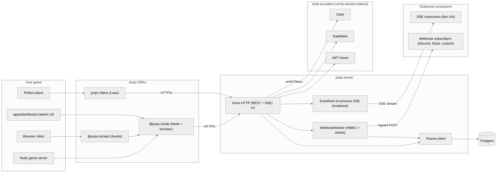

# Junjo

Game-domain primitives for groups, ranks, and permissions. A drop-in social-organization layer for any multiplayer game.

Junjo gives your game the building blocks it would otherwise spend a quarter writing from scratch: groups (guilds, parties, factions), ranks (with priority and color), permissions (with per-member overrides), invitations (direct or shareable code), real-time events (over SSE or webhooks), and a typed TypeScript SDK that runs in Node and the browser.

## What it is, in one sentence

Junjo is the same layer Stripe is for payments, Auth0 is for auth, or Pusher is for real-time: an HTTP API plus a thin native SDK. You bring your game; Junjo handles the social graph.

## How it fits together

## What it gives you

- **Groups** with kinds you define (`"guild"`, `"party"`, `"faction"`), visibility levels, metadata, and soft-delete with a 7-day undo window.
- **Members** with statuses (`active`, `invited`, `left`, `kicked`, `banned`), per-member metadata, public and private notes, optional passcode-gated public-join, and bulk-invite via CSV.
- **Roles** with priorities, colors, and a permission catalog that auto-registers as you grant.
- **Permissions** with role-derived defaults and explicit per-member overrides. `junjo.can(userId, groupId, permission)` answers in one call.
- **Invitations** by direct user id or shareable code, with optional expiry and a public preview endpoint your invite-acceptance UI can call without an API key.
- **Group relationships** (allied, hostile, asymmetric) and a parent-child hierarchy with cycle detection.
- **Bans** at two scopes -- per-group (mirror of kick that blocks rejoin) and game-wide (covers every group in the game), each with optional expiry, append-only history, and webhook events.
- **Friends graph**: requests, blocks, friend tags, per-user list visibility, mutual-friend suggestions, and a single-pair relationship probe for profile views.
- **Real-time events** through Server-Sent Events (`junjo.groups.subscribe`) and outbound webhooks (with HMAC signing, exponential-backoff retries, and per-endpoint Discord and Slack output formats).
- **Auth adapters** for Clerk, Supabase, raw JWT, and bring-your-own.
- **React hooks** in `@junjo.io/react`: `useGroup`, `useMembers`, `useInvitations`, `useAuditLog`, `useCan`, `useMutation`, plus per-list optimistic-update helpers.

## What it is not

Junjo intentionally does not handle:

- In-app chat (use Discord, Twilio, or your own).
- Authentication itself (only adapters that verify tokens issued by your auth provider).
- Game-state sync, matchmaking, leaderboards, achievements, or game-specific systems.
- DMs or message transport. Junjo gives you the [Friends graph](/api-reference/friends) (requests, blocks, visibility) but not the message bus -- build that on your own backend keyed off the friend rows.

## Get going

- **[Getting started](/getting-started)** - install the SDK and make your first call in under a minute.
- **[Tutorial](/tutorial)** - a five-minute walkthrough that creates a group, invites a user, redeems the invitation, assigns a role, and checks a permission.
- **[Self-hosting](/self-host)** - run the open-source server yourself: Docker recipes, env vars, migrations, API-key issuance, and reverse-proxy notes.

## Reference

- **[SDK](/sdk)** - per-namespace reference for `@junjo.io/sdk` (`junjo.groups`, `junjo.members`, `junjo.roles`, `junjo.invitations`, `junjo.audit`, `junjo.webhooks`, plus the top-level `can` / `check`).
- **[React](/react)** - hooks and provider in `@junjo.io/react`.
- **[API](/api)** - the HTTP API the SDKs wrap. Use raw HTTP from any language Junjo does not yet ship a native client for.
- **[Auth](/auth)** - adapter setup for Clerk, Supabase, and JWT.
