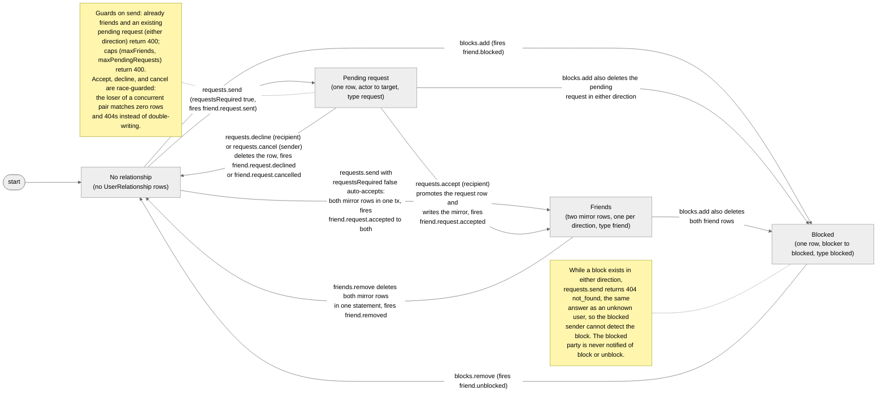

# friends

Methods on `junjo.friends`. The friends subsystem covers per-user
social graph operations: requests, friendships, blocks, tags, mutual
suggestions, and visibility. Sub-namespaces group related calls:

- [`junjo.friends.requests`](#junjofriendsrequests): request lifecycle
- [`junjo.friends.blocks`](#junjofriendsblocks): outbound blocks
- [`junjo.friends.tags`](#junjofriendstags): per-user friend-list labels
- [`junjo.friends.visibility`](#junjofriendsvisibility): who can see whose list

Top-level methods on `junjo.friends` cover the friendship list itself
and the single-pair relationship probe.

Every route is gated by the per-game [Friends configuration](/api-reference/friends#configuration); when `friends.enabled = false`, the SDK surfaces a `not_found` error so feature absence is invisible.

## User-id contract

Every `userId` / `targetJunjoUserId` / `viewerUserId` argument on this
namespace is your application's EXTERNAL user id: the same string
you pass to `junjo.groups.create`, `junjo.groups.kick`, etc. (your
Clerk sub, Supabase uuid, your own cuid, whatever). The server
resolves the external id to its internal `JunjoUser.id` via the same
`findOrCreateJunjoUser` helper every other write-path uses; unseen
users are auto-vivified on first reference. Wire fields named
`*JunjoUserId` carry the external value verbatim on the way back;
the names are historical, not a contract change.

## Request lifecycle

The whole subsystem is one state machine over a user pair. The
`friends.requestsRequired` config flag decides whether `requests.send`
creates a pending request or the friendship itself:



The diagram above is committed at `tools/diagrams/source/friend-flow.mmd`. The committed `.mmd` source and the Mermaid fence above must stay byte-identical.

## `list(userId, opts?)`

Returns a single page of `userId`'s friends in the calling game (or
across the network when `friends.scope = "network"`). Cursor-paginated;
pass the prior page's `nextCursor` to fetch the next.

```ts
const page = await junjo.friends.list("user_alice" as UserId, {
  limit: 50,
  tagId: "tag_close",
  viewer: "user_bob" as UserId,
});
for (const f of page.items) console.log(f.junjoUserId, f.since);
```

### Options

| Field | Type | Notes |
|-------|------|-------|
| `limit` | number | 1-100. Defaults to 50. |
| `cursor` | string | The `nextCursor` from a previous call. |
| `tagId` | string | Filters to friends tagged with this tag. Tags are per-game, so this contracts to the calling game (no network expansion). |
| `viewer` | `UserId` | Optional. When set, [visibility rules](/api-reference/friends#visibility) are enforced from this viewer's perspective. Omit for admin-style access (the API-key caller bypasses visibility). |

When `viewer` is set and that viewer is not permitted to see the list
(blocked by the target, or outside the owner's visibility setting),
the call throws `404 not_found` rather than returning an empty page.
Treat `not_found` from this route as "this viewer cannot see the
list", not "the user does not exist".

### Returns

`FriendshipPage`:

| Field | Type | Notes |
|-------|------|-------|
| `items` | `Friendship[]` | One row per friend (the OTHER party), sorted by `since` desc. |
| `nextCursor` | string \| null | `null` when this is the last page. |

## `listAll(userId, opts?)`

Async-iterator wrapper over `list`. Yields one `Friendship` per
iteration until the cursor exhausts.

```ts
for await (const f of junjo.friends.listAll("user_alice" as UserId)) {
  // ...
}
```

## `remove(userId, otherUserId)`

Unfriend. Removes both directions of the friendship in one
transaction. Fires `friend.removed` to the OTHER party.

```ts
await junjo.friends.remove("user_alice" as UserId, "user_bob" as UserId);
```

## `getRelationship(viewerUserId, otherUserId)`

Single-pair viewer-perspective probe. Returns the relationship between
the two users from `viewerUserId`'s point of view in one round trip.
Use this on a profile view to render a FriendButton without paging
through `list`.

```ts
const rel = await junjo.friends.getRelationship(
  "user_alice" as UserId,
  "user_bob" as UserId,
);
if (rel.state === "friends") {
  // render "Friends since {rel.since.toLocaleDateString()}"
}
```

### Returns

`FriendshipRelationship`:

| Field | Type | Notes |
|-------|------|-------|
| `state` | `FriendshipState` | One of `"friends"`, `"request_outgoing"`, `"request_incoming"`, `"blocked_by_me"`, `"blocked_by_them"`, `"none"`. |
| `since` | `Date \| undefined` | Friendship `respondedAt`, request `createdAt`, or block `createdAt`. `undefined` for `state: "none"`. |

**Priority** (when multiple row types coexist, viewer-side wins):
viewer-side block → other-side block → friendship → pending request
direction → none. The viewer-side block takes precedence on the
both-blocked edge case so the viewer's UI shows the block they can
act on.

### Errors

| Code | Status | When |
|------|--------|------|
| `bad_request` | 400 | `viewerUserId === otherUserId`. |
| `not_found` | 404 | `friends.enabled = false` for the calling game. |

### See also

- [`GET /v1/users/:viewerUserId/friends/:otherUserId/relationship`](/api-reference/friends#get-v1usersvieweruseridfriendsotheruseridrelationship) - the underlying HTTP route.

## `suggestions(userId, opts?)`

Ranked candidates who share at least
`friends.discovery.minMutuals` friends with `userId`, excluding
existing friends and anyone blocked in either direction.

```ts
const candidates = await junjo.friends.suggestions("user_alice" as UserId, { limit: 10 });
for (const c of candidates) {
  console.log(c.junjoUserId, `${c.mutualCount} mutuals`);
}
```

Returns `FriendSuggestion[]`. Each entry carries `junjoUserId`,
`mutualCount`, and up to five `sampleMutualJunjoUserIds` so the UI
can render "you know A, B, +N others" without a follow-up fetch.

`404 not_found` when `friends.discovery.enabled = false`.

---

## `junjo.friends.requests`

### `list(userId, opts?)`

Lists pending requests. Returns `{ inbound, outbound }` with
deserialized `FriendRequest` objects (`createdAt` is a `Date`, not an
ISO string).

```ts
const { inbound, outbound } = await junjo.friends.requests.list(
  "user_alice" as UserId,
  { direction: "in" },
);
```

| Option | Type | Notes |
|--------|------|-------|
| `direction` | `"in" \| "out" \| "both"` | Defaults to `"both"`. `"in"` only populates `inbound`; `"out"` only populates `outbound`. |

### `send(userId, targetJunjoUserId)`

Sends a friend request, or (when `friends.requestsRequired = false`)
auto-creates the friendship.

```ts
const result = await junjo.friends.requests.send(
  "user_alice" as UserId,
  "user_bob_junjo_id",
);
if (result.status === "pending") {
  // result.request is set; fires `friend.request.sent` to the target
} else {
  // result.status === "auto-accepted"
  // result.friendship is set; fires `friend.request.accepted` to both
}
```

Despite its historical name, `targetJunjoUserId` carries your
application's EXTERNAL user id, exactly like every other user-id
argument on this namespace (see the [user-id contract](#user-id-contract)
above). The server resolves it through `findOrCreateJunjoUser`, so an
unseen target is auto-vivified on first reference; no lookup step is
needed.

### `accept(requestId)`

Promotes a pending request to a friendship. Fires
`friend.request.accepted` to the original sender. Returns the new
`Friendship`.

### `decline(requestId)`

Recipient declines the request. Fires `friend.request.declined` to
the original sender so their UI can drop the outbound row.

### `cancel(requestId)`

Original sender retracts an outbound request. Fires
`friend.request.cancelled` to the original target.

---

## `junjo.friends.blocks`

### `list(userId)`

Lists `userId`'s outbound blocks. Returns `Block[]`.

### `add(userId, targetJunjoUserId)`

Adds a one-directional block. Implicitly removes any friendship rows
in either direction AND any pending requests in either direction
(one transaction). Idempotent: re-blocking the same user returns the
existing row. Fires `friend.blocked` carrying
`{ byJunjoUserId, otherJunjoUserId }`.

### `remove(userId, otherUserId)`

Removes the block. Fires `friend.unblocked`.

The blocked party is never notified by Junjo of either event;
consumers typically suppress in-app notifications to them in their
own webhook handler.

---

## `junjo.friends.tags`

Per-(user, game) labels for organizing one's own friend list. Tags
are private to the owner: only the user that created the tag sees it
applied. Tags only attach to the owner-side friend row, so each party
in a friendship can tag independently.

### `list(userId)`

Lists `userId`'s tags in the calling game, sorted by name. Returns `FriendTag[]`.

### `create(userId, input)`

```ts
const tag = await junjo.friends.tags.create("user_alice" as UserId, {
  name: "Close friends",
  color: "#ff5050",
});
```

`color` is optional (`#rrggbb`). Capped by `friends.tags.maxPerUser`.

### `update(tagId, patch)`

Update name and/or color. `color: null` clears it.

### `delete(tagId)`

Cascades to all `UserRelationshipTag` rows.

### `assign(userId, otherUserId, tagIds)`

Replace the tag set on one friendship. The handler validates that
every supplied `tagId` belongs to `userId` in the calling game;
cross-game tagging is rejected with `400`. Empty array clears all
tags. Returns the resulting `FriendTagAssignment`.

```ts
await junjo.friends.tags.assign(
  "user_alice" as UserId,
  "user_bob" as UserId,
  ["tag_close", "tag_guild"],
);
```

---

## `junjo.friends.visibility`

### `get(userId)`

Returns `userId`'s `friendsListVisibility` setting in the calling
game, falling back to `config.friends.visibility.default` when no
row exists. The response also surfaces the `allowed` set so the
dashboard can render the right radio options.

### `set(userId, value)`

```ts
await junjo.friends.visibility.set("user_alice" as UserId, "friends-only");
```

Values:

- `"private"`: only the owner + admin can list this user's friends.
- `"friends-only"`: confirmed friends can also see.
- `"public"`: any caller can see (subject to the calling game's `allowed` list).

Validates against `config.friends.visibility.allowed`. Enforcement
on `list` only runs when the caller supplies a `viewer` (admin
callers bypass).

---

## Webhook events

Seven `UserEventBase` events fire from this subsystem. None carry a
`groupId`, so SSE doesn't deliver them; subscribe via [webhooks](/api-reference/webhooks):

| event | when | payload |
|-------|------|---------|
| `friend.request.sent` | `requestsRequired = true`, on `requests.send` | `actorJunjoUserId` (sender), `targetJunjoUserId` (recipient) |
| `friend.request.accepted` | on `requests.accept`, or auto-accept `requests.send` | `actorJunjoUserId`, `targetJunjoUserId`, `respondedAt` |
| `friend.request.declined` | on `requests.decline` | same actor/target as the original request |
| `friend.request.cancelled` | on `requests.cancel` | same actor/target as the original request |
| `friend.removed` | on top-level `remove` | `removedByJunjoUserId`, `otherJunjoUserId` |
| `friend.blocked` | on `blocks.add` | `byJunjoUserId`, `otherJunjoUserId` |
| `friend.unblocked` | on `blocks.remove` | `byJunjoUserId`, `otherJunjoUserId` |

### See also

- [Friends API reference](/api-reference/friends) - HTTP routes, configuration, scope semantics.
