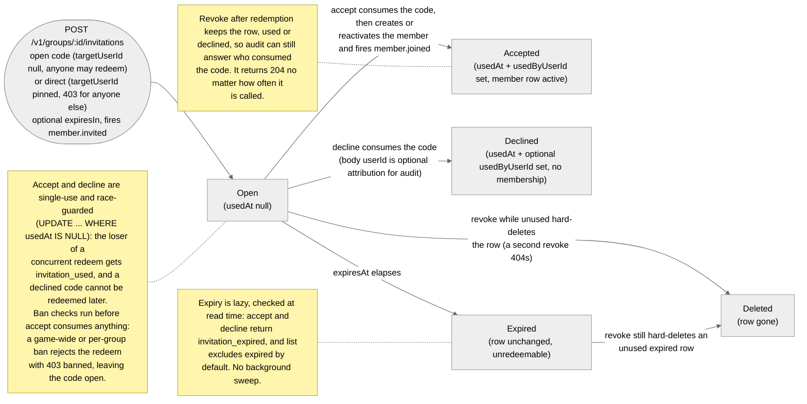

# invitations

Methods on `junjo.invitations`.

For the create-side methods, see [`junjo.groups.inviteByUserId`](/sdk/groups), [`junjo.groups.inviteByCode`](/sdk/groups), and [`junjo.groups.inviteByLink`](/sdk/groups). The methods below operate on existing invitations.

## Lifecycle

Every invitation is a single-use code that moves through this state machine (accept and decline live on [`junjo.groups`](/sdk/groups) as `acceptInvitation` / `declineInvitation`; `revoke` is below):



The diagram above is committed at `tools/diagrams/source/invitation-lifecycle.mmd`. The committed `.mmd` source and the Mermaid fence above must stay byte-identical.

## `list(groupId, opts?)`

Lists invitations for a group, sorted newest-first. Cursor-based pagination via the `Page<T>` envelope. By default the response excludes used and expired invitations; pass `includeUsed: true` and/or `includeExpired: true` to include them.

```ts
let cursor: string | null | undefined;
do {
  const page = await junjo.invitations.list("grp_xyz" as GroupId, {
    limit: 50,
    cursor: cursor ?? undefined,
  });
  for (const invitation of page.items) {
    console.log(invitation.code, invitation.targetUserId);
  }
  cursor = page.nextCursor;
} while (cursor);
```

### Options

| Field | Type | Default | Notes |
|-------|------|---------|-------|
| `limit` | number | `50` | 1-100 inclusive. |
| `cursor` | string | undefined | The `nextCursor` from a previous `list` call. Must point at an invitation in this group. |
| `includeExpired` | boolean | `false` | When `true`, expired invitations are included. |
| `includeUsed` | boolean | `false` | When `true`, used invitations are included. |

### Returns

`Page<Invitation>` with timestamps deserialized to `Date`.

### Errors

| Code | Status | When |
|------|--------|------|
| `bad_request` | 400 | `limit` out of range, unknown `cursor`, or unrecognized `includeExpired`/`includeUsed` value. |
| `not_found` | 404 | No group with that id in the calling game (also for soft-deleted rows and cross-game ids). Thrown, not converted to `null`. |
| `invalid_api_key` | 401 | API key missing, malformed, or revoked. |

### See also

- [`GET /v1/groups/:id/invitations`](/api-reference/groups) - the underlying HTTP route.

## `get(code)`

Fetches an invitation by code. The underlying server route does not require an API key (anyone with the code can fetch the preview), but the SDK still sends the configured `apiKey` header on every request.

Returns `Invitation | null`: the SDK turns `404 not_found` into `null` so callers can branch on `if (invitation)` without a try/catch. Other errors (invalid API key, network failure, etc.) throw `JunjoError`.

```ts
const invitation = await junjo.invitations.get("abcd1234abcd1234");
if (!invitation) {
  return; // unknown code, or the group was soft-deleted
}
if (invitation.usedAt) {
  // already redeemed
} else if (invitation.expiresAt && invitation.expiresAt < new Date()) {
  // expired
} else {
  // valid: render the accept UI
}
```

### Errors

| Code | Status | When |
|------|--------|------|
| `invalid_api_key` | 401 | API key missing, malformed, or revoked. (The route allows unauthenticated requests; the SDK still sends the header.) |

`404 not_found` is converted to `null`; it is not thrown.

### See also

- [`GET /v1/invitations/:code`](/api-reference/invitations) - the underlying HTTP route.

## `revoke(code)`

Revokes (deletes) an invitation by code. Returns `void` on success.

- An **unused** invitation is hard-deleted; a second `revoke` call returns the server's `not_found` error (the row is gone).
- An **already-used** invitation is left in place (to preserve the redemption history); `revoke` returns `void` regardless of how many times it is called.

```ts
await junjo.invitations.revoke("abcd1234abcd1234");
```

### Returns

`Promise<void>`.

### Errors

| Code | Status | When |
|------|--------|------|
| `not_found` | 404 | No invitation with that code in the calling game (cross-game codes also return 404). Thrown. |
| `invalid_api_key` | 401 | API key missing, malformed, or revoked. |

### See also

- [`DELETE /v1/invitations/:code`](/api-reference/invitations) - the underlying HTTP route.
