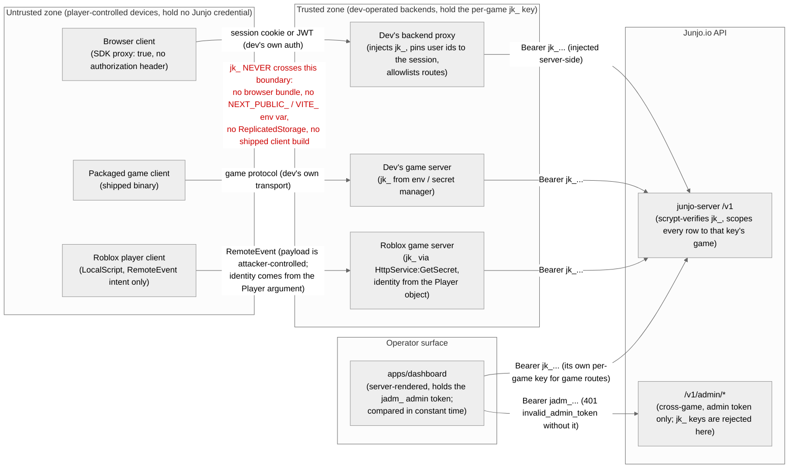

# Security model

This page is the canonical description of who may hold which Junjo credential and what each side of the trust boundary is responsible for. The per-namespace SDK pages assume this model; when in doubt about where a key may live, this page wins.

## Trust boundaries

Two credentials exist, and each lives in exactly one zone. The per-game `jk_` key lives on dev-operated backends only: a Node game server, the backend proxy that fronts browser clients ([proxy mode](/react/provider#browser-apps-proxy-mode)), or a Roblox game server reading it from the secret store ([Roblox SDK](/roblox)). The cross-game `jadm_` admin token lives on the operator surface (the dashboard's server process) and gates only `/v1/admin/*`; the SDK constructor rejects it outright. Player-controlled devices hold neither: they carry your app's own session credential to your backend, and your backend decides what reaches Junjo.

The diagram above is committed at `tools/diagrams/source/trust-boundary.mmd`. The committed `.mmd` source and the Mermaid fence above must stay byte-identical.

The red edge is the one that must never exist. A `jk_` key that reaches a player-controlled device grants that player full control of your game's Junjo data; the trusted zone is also where per-user authorization happens (the proxy pins user-id path segments to the session, the Roblox server derives identity from the `Player` argument), because the key itself bypasses per-user permission checks.

## Per-platform guidance

| Platform | Rule |
|----------|------|
| Browser / WebGL builds | Proxy mode only. Construct with `proxy: true`; the SDK sends no credential and your backend injects the key. Never a `NEXT_PUBLIC_` / `VITE_` env var, never in the bundle. See the [browser guide](/browser) and [JunjoProvider](/react/provider#browser-apps-proxy-mode) |
| Node game servers, API routes, workers | Hold `jk_` in env or a secret manager. The SDK warns once if a `jk_` key is constructed where `window` exists |
| Roblox | Server scripts only (`ServerScriptService`), key from the secret store via `HttpService:GetSecret`, never `ReplicatedStorage` and never a `LocalScript`. Player identity comes from the `Player` object, not from `RemoteEvent` payloads. See the [Roblox SDK](/roblox) |
| Shipped desktop / mobile clients | Same as browsers: the binary is player-controlled, so it holds no key and talks to your game server, which talks to Junjo |
| Operator dashboard | The only holder of the `jadm_` admin token (`JUNJO_ADMIN_TOKEN`, compared in constant time, gates `/v1/admin/*` only). Routes are disabled entirely when the env var is unset |

## The key is admin-class; your backend is the authorization layer

Within its game, a `jk_` key can do everything: read secret groups, kick anyone, grant any permission, act as any user. Junjo v1 deliberately performs no per-end-user authorization of its own; the roles-and-permissions system exists for *you* to query (`junjo.can`, `junjo.check`), and read paths are admin-bypassed because the only caller principal is the key.

That makes the process holding the key responsible for two things on every player-triggered call:

1. **Identity pinning**: derive the acting `userId` from something the player cannot forge (your session, your JWT, the Roblox `Player` object), never from client-supplied input.
2. **Policy**: decide whether that user may perform the action, typically by calling `junjo.check` first or by encoding rules in your handlers.

The [browser guide](/browser) shows both in a working proxy.

## Key rotation

A game can hold many `jk_` keys at once, so rotation is overlap, not downtime: mint a new key (`POST /v1/admin/games/:gameId/api-keys`, admin token required; also available in the dashboard), deploy it, then revoke the old one (`POST /v1/admin/games/:gameId/api-keys/:keyId/revoke`). Revocation is immediate; revoked keys answer `401 invalid_api_key`. The secret half of a key is scrypt-hashed at rest and returned exactly once at mint time; if a key leaks, rotate, do not try to recover it.

## Webhook secrets

- The signing secret (16-256 chars; auto-generated as 43 chars of base64url when you omit it) is returned once, in the `201` response of endpoint creation. Every later read of the endpoint omits it. Store it like a password.
- Deliveries in `junjo` format are signed `v1=<hex HMAC-SHA256>` over `timestamp.body`; the SDK's `verify` / `verifyWithMeta` do a constant-time compare and enforce a replay window of 5 minutes clock skew either way (override via the `tolerance` option). Signature is checked before the timestamp is even parsed, so probes learn nothing about your clock.
- Delivery is at-least-once. Dedupe on `eventId` from `verifyWithMeta` (stable across retries), not `deliveryId` (unique per attempt).
- Discord and Slack format endpoints are unsigned; there the webhook URL token is the credential, so treat the URL itself as a secret.
- Verify against the raw request bytes (mount `express.raw` before the middleware); a re-serialized body will not match the signature.

## What Junjo never sees or stores

- **No passwords, no accounts.** Junjo has no user records beyond an opaque identity anchor; authentication stays with your provider, and the auth adapters only verify tokens your provider issued.
- **External user ids are opaque.** Junjo stores the id string you send and never interprets, enriches, or shares it. Send stable ids, not emails or display names, and it never holds PII for your players.
- **Secrets are hashed at rest.** API-key secrets and group passcodes are scrypt-hashed; neither is recoverable, and passcodes never appear on the wire (reads expose only `hasPasscode`).
- **Admin token is not in the database.** `jadm_` is a server-wide env secret compared in constant time.

Vulnerability reports go to the address in [SECURITY.md](https://github.com/GabeCurran/junjo/blob/main/SECURITY.md), not GitHub issues.
