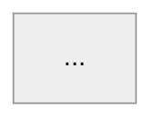

# @junjo/diagrams

Mermaid diagram source files plus a thin renderer that produces PNG or SVG
previews. The committed artifact is the `.mmd` source under `source/` plus
the Mermaid code fence embedded in the relevant Nextra MDX page; the rendered
images under `output/` are gitignored and exist for visual iteration on the
diagrams (write `.mmd` source, render, view PNG, iterate).

A sync gate asserts every committed `.mmd` source matches the version
embedded in its corresponding MDX page; see "Embedding in the docs site"
below.

## Layout

```
tools/diagrams/
  source/
    *.mmd                 committed Mermaid source (one diagram per file)
  output/                 rendered PNG / SVG previews (gitignored)
  src/
    render.ts             CLI entry: parse args, discover sources, run mmdc
    args.ts               CLI argument parser
    discover-sources.ts   FS walk over source/*.mmd
    render-plan.ts        builds the {source -> output} task list
  README.md
  package.json
  tsconfig.json
  .puppeteerrc.cjs        skips chromium auto-download on npm install
```

## First-time setup

`@mermaid-js/mermaid-cli` (`mmdc`) drives Puppeteer to render diagrams via
headless chromium. The chromium auto-download is disabled (see
`.puppeteerrc.cjs`) so a fresh `npm install` does not pay the 280MB cost
for a workspace most contributors never run. Before the first
`npm run diagrams`, install chromium explicitly from this workspace:

```sh
cd tools/diagrams
npx puppeteer browsers install chrome
```

Or set `PUPPETEER_EXECUTABLE_PATH` to point at a chromium you already have
(Playwright ships its own copy under
`node_modules/playwright/.local-browsers/`).

## Usage

```sh
# Render every .mmd under source/ to PNG under output/
npm run diagrams

# Render a single source by slug (filename without the .mmd extension)
npm run diagrams -- --file=system-architecture

# Emit SVG instead of PNG
npm run diagrams -- --format=svg

# Override the source or output directory
npm run diagrams -- --source-dir=/tmp/src --out-dir=/tmp/out
```

The CLI exits non-zero on a mmdc render error or an unknown filter slug.
All other flags follow the same `--key=value` shape used by
`tools/screenshots`.

## Style conventions

Every `.mmd` source starts with a theme directive so the diagrams render
consistently:



Use `flowchart` over the older `graph` keyword. Keep node labels concise.
Cross-diagram visual style (colors, fonts, edge styles) follows Mermaid's
`neutral` theme defaults; do not override per-diagram unless there is a
specific reason and the override is documented.

## Embedding in the docs site

Each diagram has two homes:

1. The committed `.mmd` source in `tools/diagrams/source/<slug>.mmd`.
2. A Mermaid code fence in the relevant MDX page under `apps/docs/pages/`.

Nextra v3 renders Mermaid client-side from `mermaid` code fences. The
two copies must stay byte-identical (same theme directive, same diagram
body).

The mapping from a `.mmd` slug to its embed target(s) lives in
`src/embed-map.ts`. Each entry pairs a slug (the `.mmd` filename without
extension) with one or more repo-relative MDX paths. To add a new
diagram: write the `.mmd` source under `source/`, embed it in the
relevant MDX page as a `mermaid` fence, then add a row to `EMBED_MAP`.

`src/check-sync.ts` reads each entry, extracts the lone mermaid fence
from each embed target, and asserts byte-identity with the source after
normalising line endings and trailing whitespace. The script exits non-
zero on drift. Run directly with `npm run diagrams:check-sync`, or rely
on the equivalent assertion baked into the workspace's vitest suite
(`src/check-sync.test.ts`); the latter runs as part of the root
`npm test` cascade and therefore inside the loop's `verify.ps1` gate.

V1 enforces exactly one mermaid fence per embed target so the matching
is unambiguous. Pages without a mapped diagram are not scanned; the
gate is opt-in via `EMBED_MAP`.

## Visual iteration loop

When editing a diagram:

1. Edit `tools/diagrams/source/<slug>.mmd`.
2. Run `npm run diagrams -- --file=<slug>` to render just the changed diagram.
3. View the resulting PNG to validate layout, label placement, edge
   crossings, and overall clarity.
4. Iterate until the diagram is readable at the desktop default zoom.
5. Sync the updated source into the relevant MDX page in the same commit.

The single-file filter keeps the cycle tight (one `mmdc` invocation takes
a few seconds versus rendering every diagram in `source/`).

## Why mermaid-cli instead of rendering at docs build time only

Nextra renders Mermaid in the browser, so production docs do not need
`mmdc`. Contributors do, because PNG output is the fastest way to
validate that the Mermaid syntax produces a readable diagram before
committing.
